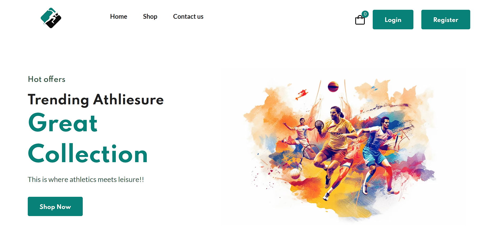
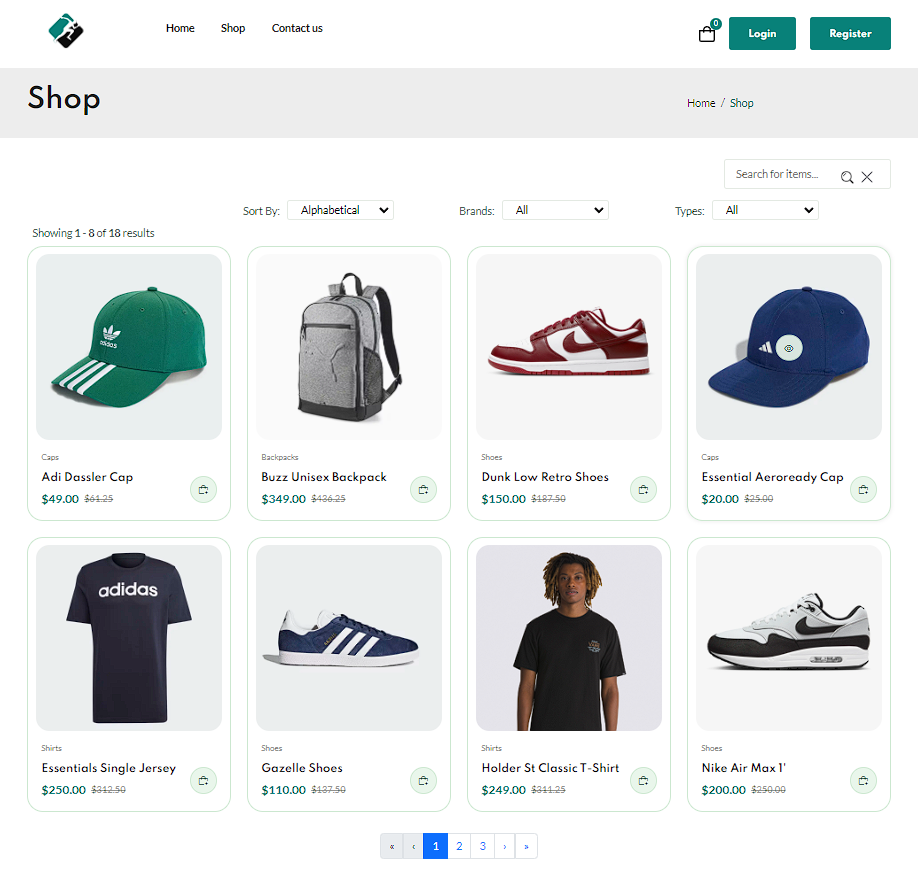
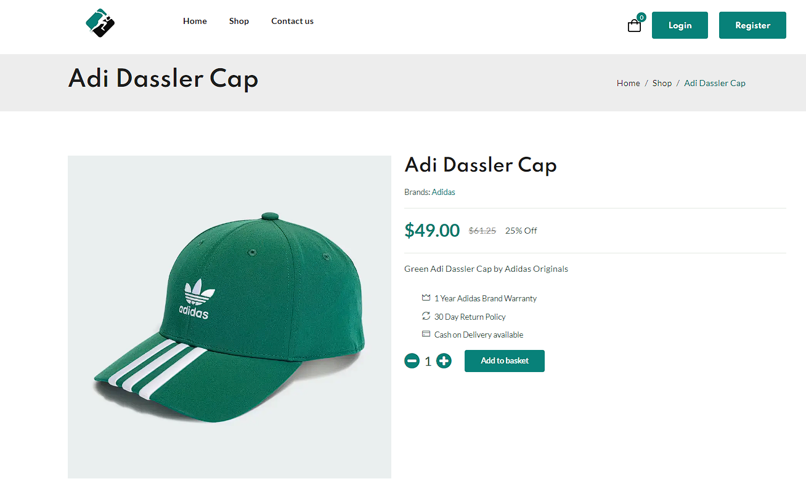
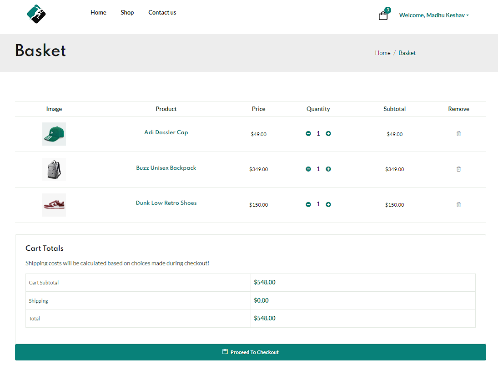
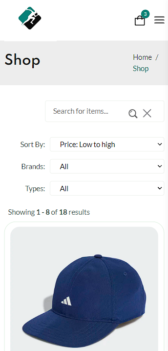

# Athleisure - An Ecommerce WebApp

Athleisure is a responsive full-stack Ecommerce web application where users can register/login, browse and buy athleisure products. The client side of this application is built using Angular 15. Additional styling for the frontend was accomplished using HTML, CSS, Bootstrap and ngx-Bootstrap. The server-side of the application consists of REST APIs built using .NET 7. The database was built using the code-first approach and the application uses PostgreSQL to store all the data.

### Project Features

- **User Authentication** : Users can register/login using a valid username and a password. The ASP.NET Core Identity library is used to validate the users authenticity and generate a JWT token which can then be used for subsequent validations.

- **Search/Filter/Sort Products**: The users can search for items using a specific keyword. The user can also filter the products based on the brand or type of items. The items can also be sorted based on alphabetical order, increasing or decreasing order of prices.

- **Paginated Results**: The server side .NET Web APIs have been developed to provide paginated results and it's associated metadata. At the client side ngx-bootstrap's pagination component is used to enable users to navigate through the paginated results.

- **Shopping Cart**: The users can add/remove any given quantities of items to the shopping cart. The shopping cart information is made to persist even without user login using Redis cache.

- **Breadcrumbs**: The breadcrumb functionality has been implemented in the section header of every page so that it is easier for the users to navigate around the website.

- **Responsive**: The webpages are responsive and is developed for all screen sizes using media queries. This makes it a mobile-friendly website.

- **Clean Architecture**: The server-side software has been developed to conform into the "Clean Architecture" architectural paradigm. The data access logic is implemented using the specification pattern alongside a generic repository.

- **Other functionalities**: Implemented client side error handling using interceptors, display the errors using toast notifications, component routing using Angular's routing capabilities.

### Tools/Technologies used:

- **Programming languages**: C#, Typescript, SQL, HTML, CSS
- **Frameworks**: .NET 7, Angular 15
- **Tools**: PostgreSQL, Redis cache
- **Libraries**: Bootstrap, ngx-Bootstrap, RxJS, ASP.NET Core Identity, EF Core 6, AutoMapper

### Snapshots

- **Home page**

   

- **Browse products**

   

- **Product details**

   

- **Shopping Cart**

   

- **Responsive**

   
